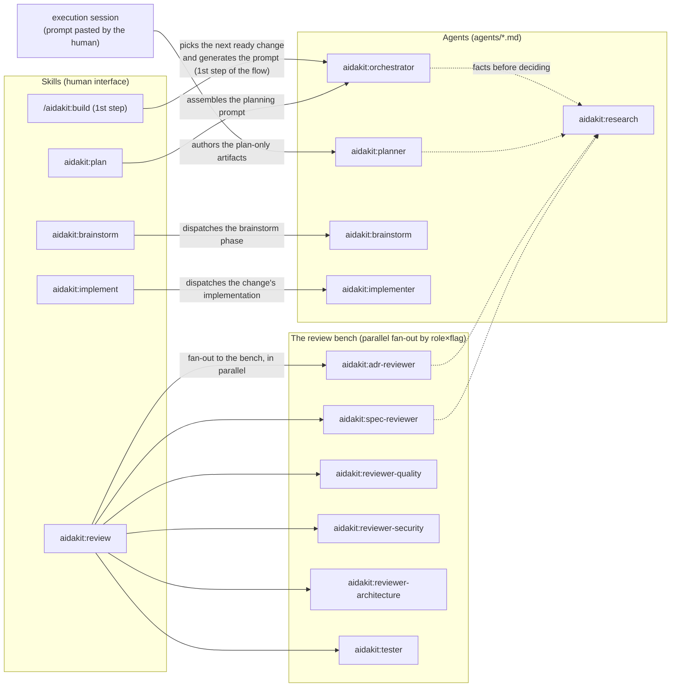

# Reference — the 11 aidakit agents

> Reference of the agents in the plugin's [`agents/`](../../agents/). Each agent `.md` file is the source of truth of its own behavior; the doctrine they all obey is [GOVERNANCE.md](../../GOVERNANCE.md) (authority, roles, guardrails) and [DOCS.md](../../DOCS.md) (document placement). **If this guide diverges from the linked skill/doctrine or from the agent's `.md`, the other wins and this file is corrected.**

All agents follow the mandatory anatomy of [GOVERNANCE.md](../../GOVERNANCE.md) §7 — Role · Protocol · What it decides on its own · Escalation triggers · What it does NOT do · Output format — and the three escalations of §1 (merging a PR, superseding an ADR, leaving the scope) apply to all of them, always.

## Who calls whom

The skills are the human interface; they delegate to the agents via the `Agent` tool (see [PROCESS.md](../../PROCESS.md) §3).



An important flow detail: [aidakit:plan](../../skills/plan/SKILL.md) and the 1st step of `/aidakit:build` invoke the `aidakit:orchestrator` only to **assemble a self-contained prompt**; whoever runs the `aidakit:planner` (or implements) is the **new session** where the human pastes that prompt. The cycle closes when the human reports "`<change-id>` done, PR #N merged" — back to the orchestrator.

---

## aidakit:orchestrator

**Role** — coordinates the target repo's multi-agent workflow: it does not execute tasks; it picks the next ready change, generates self-contained execution prompts (serial or parallel with worktrees), and keeps the change pipeline accurate.

- **Model:** `opus` · **Tools:** Read, Bash, Edit, Glob, Grep
- **Who invokes it:** the 1st step of `/aidakit:build` and the [aidakit:plan](../../skills/plan/SKILL.md) skill; the human, when reporting a change as completed ("`<change-id>` done, PR #N merged").
- **Decides on its own:** to reprioritize changes on noticing a real dependency mismatch; to add a discovery task to an in-flight plan (delegating the investigation to `aidakit:research`); to mark a change as blocked with a one-line note; to choose among several ready changes (prefers the one that unblocks the most downstream); to auto-detect serial vs parallel by the surfaces touched in the proposal.
- **Escalates:** the 3 of GOVERNANCE.md §1, plus two coordination-conflict cases (§6): active changes and the git state diverge with no reconciliation possible; an open decision-log item blocks the next ready change.
- **Does NOT:** merge a PR (never), commit directly to main (not even bookkeeping), edit plans/specs (the `aidakit:planner`'s work), write product code.
- **Output format:** terse, with no structured verdict — when generating a prompt, it delivers the prompt and stops; when archiving, it reports in 1–2 lines.

In razor: asked "what's next", it inspects `docs/features/`, the `git log`, and `docs/design/STATE.md`, picks `feature-appointment-cancellation` as ready, and returns the execution prompt with the commit hash, artifact paths, and the escalations embedded.

Source of truth: [agents/orchestrator.md](../../agents/orchestrator.md)

---

## aidakit:brainstorm

**Role** — the isolated executor of the adversarial brainstorm (the 1st phase of the specification, before writing a spec or spending tokens): it grills the owner on the 4 attack axes (scope, end effect, edges, confrontation with the law) to extract the doubt they didn't know they had, and returns premises + acceptance criteria — it never implements nor writes a spec.

- **Model:** `sonnet` · **Tools:** Read, Glob, Grep, AskUserQuestion (no `Write`/`Edit`/`Bash` on purpose — brainstorm is thinking, not code)
- **Who invokes it:** the [aidakit:brainstorm](../../skills/brainstorm/SKILL.md) skill, which dispatches the phase (at the start of any broad/architectural/irreversible change, or as the 1st step of the completo flow). It receives the envelope `{ request, domain, ammunition }` — the owner's request, the already-classified domain, and the project's ammunition (ADRs, Definition of Done, inviolable rules, external resource material).
- **Decides on its own:** how many questions to ask and how deeply to grill (calibrated by the change's complexity); which axis to attack first and which thread to follow after each answer; whether a doubt is critical (interrogates until resolved → becomes an acceptance criterion) or small/reversible (becomes a recorded premise, fixable later); how to word each premise and criterion.
- **Escalates:** an owner's answer that contradicts an inviolable rule / locked ADR → records the collision as a premise marked **`REQUIRES HUMAN DECISION — contradicts ADR-00N`** and stops (escalation 2, an agent never bypasses a recorded decision); a request that on being grilled reveals scope beyond the approved (escalation 3); grilling that would require stepping out of the role (implement, write the spec, edit an artifact).
- **Does NOT:** implement; write the spec or any change artifact (proposal/design/tasks/evidence — it only extracts the requirement, spec generation is another role's job); turn into an infinite interrogation; fire off generic questions (every question confronts the request against the project's real ammunition); decide to advance on its own against a recorded decision.
- **Output format:** a verdict block with the **machine-parseable trail event at the top** — `brainstorm-event: { "kind": "brainstorm", "questions": <n>, "assumptions": <n> }` (or `"kind": "brainstorm-skipped"` on the owner's opt-out) — followed by the premises, acceptance criteria (the observable effect of "done", never `success: true`), questions asked, and escalations. The `brainstorm-event:` line is the trail that **satisfies the `brainstorm` phase gate**: without it the flow does not transition from `brainstorm` to `specify`.

In razor: when grilling "up to 2h beforehand, no penalty", it attacks the confrontation-with-the-law axis — "that's ADR-003's inviolable rule; does your request respect it or do you want a recorded exception?" — and returns the acceptance criterion for the observable effect ("the cancelled appointment frees the professional's window for a new booking", not "returns 200").

Source of truth: [agents/brainstorm.md](../../agents/brainstorm.md)

---

## aidakit:planner

**Role** — the author of plan-only changes: it produces the four planning artifacts (`proposal.md`, `design.md`, `tasks.md`, a stub of `evidence.md`, plus optional spec deltas) and never writes product code.

- **Model:** `opus` · **Tools:** Read, Bash, Edit, Write, Glob, Grep
- **Who invokes it:** the execution session created from the prompt generated by [aidakit:plan](../../skills/plan/SKILL.md) (`subagent_type: "aidakit:planner"`).
- **Decides on its own:** which ADRs are in scope; which specs are extended vs untouched; the structure of the `design.md`; whether it proposes a new ADR (default: no — only when the task inherently introduces a locked decision, and as a draft); the granularity of the `tasks.md` (one bullet per discrete deliverable).
- **Escalates:** contradicting/superseding an ADR (presents the contradiction with citations; may draft the superseder, never decide it); an ambiguity that materially changes the plan; extra work implied in the request; a mandatory input missing; two ADRs in conflict; a task that touches an open decision. A change-id that already exists → refuses and asks whether to extend or rename.
- **Does NOT:** product code, configs, CI, migrations; commits, PRs, or archive (ship is a separate step); run the reviewers over its own work — an author does not approve what it authors (GOVERNANCE.md §3).
- **Output format:** no verdict — it prints, in this order: the change directory's path, the files written, the ADRs/specs read, the escalations (if any), and the next-step instruction ("Run `aidakit:adr-reviewer` and `aidakit:spec-reviewer` in parallel against `<change-dir>`...").

In razor: it authors `docs/features/feature-appointment-cancellation/` with the "up to 2h beforehand, no penalty" policy in the proposal, citing the target repo's ADRs in `docs/decisions/` — `ADR-003-appointment-as-aggregate.md` and `ADR-004-notification-async-outbox.md`, and a spec delta of the appointment capability — which only merges into `docs/specs/` at the human promotion gate ([DOCS.md](../../DOCS.md) §4).

Source of truth: [agents/planner.md](../../agents/planner.md)

---

## aidakit:implementer

**Role** — the isolated executor of implementation for an already-planned and approved change: it turns approved tasks into code+tests on the change's branch/worktree, task by task with TDD (RED → GREEN → REFACTOR) and the kit's quality bars, in its own context — without committing, without opening a PR, and without approving its own work.

- **Model:** `sonnet` · **Tools:** Read, Write, Edit, Bash, Glob, Grep
- **Who invokes it:** the [aidakit:implement](../../skills/implement/SKILL.md) skill, which dispatches the change's implementation (at the flow's `implement` step, or when the owner asks to implement an already-planned change with `Status: APPROVED` from readiness). It receives `{change-id, approved tasks}` and returns `{diff, marked tasks, outcome, correction events}`. It supports OpenSpec repos (`openspec/changes/<change-id>/tasks.md`) and kit mode (`docs/features/<change-id>/tasks.md`).
- **Decides on its own:** how to implement each task within the approved design (internal structure, names, helpers, test order); where to draw the boundary of each test (the minimal behavior per RED case); local refactors that keep it green; when a bug requires root cause via systematic-debugging vs. an obvious fix; which edge cases raised in the plan become explicit tests.
- **Escalates:** a plan premise changed in the anti-drift re-inspection, or a task/implementation leaves the approved scope (escalation 3); the implementation only closes by contradicting a locked ADR (escalation 2 — names the contradiction with citations, stops). Every escalation produces `outcome: failure` with the reason, for the caller to route back to the plan or the human — it does not force.
- **Does NOT:** commit or open a PR (ship is a separate step, [aidakit:ship](../../skills/ship/SKILL.md) — author ≠ shipper); approve its own work (the gates run afterward, invoked by the caller); implement without `Status: APPROVED`; write code before the test (the Iron Law of TDD, no exception); expand scope beyond the approved tasks; supersede an ADR or force over a changed premise; run unversioned commands or stage secrets.
- **Output format:** a machine-parseable verdict — surfaces touched, tasks marked/total, the diff (paths or `git diff --stat`), the correction events (`{ kind: "correction", task, root_cause, fix }` — input the [aidakit:learn](../../skills/learn/SKILL.md) consolidates later), the validation (the repo's exact test command + result) and, always on the last line, **`Outcome: success | failure`** — the signal the flow consumes to route.

In razor: it receives the cancellation change with `Status: APPROVED`, re-inspects the repo (correct branch, paths exist), implements task by task with RED-before-GREEN, writes the test for the `CancellationOutsideWindow` refusal case that the spec requires, runs the surface's suite green, and returns `Outcome: success`.

Source of truth: [agents/implementer.md](../../agents/implementer.md)

---

## aidakit:adr-reviewer

**Role** — reviews a plan, design doc, spec change, or diff against the target repo's locked ADRs, reporting specific violations with an ADR reference + line — never fixing them.

- **Model:** not declared in the frontmatter (uses the environment default) · **Tools:** Read, Glob, Grep, Bash
- **Who invokes it:** the [aidakit:review](../../skills/review/SKILL.md) skill (in parallel with the `aidakit:spec-reviewer`, in the same message), at both gates of the cycle.
- **Decides on its own:** which ADRs are in scope; whether a finding is critical (blocks the merge) or minor; to flag when two ADRs are in tension and the change chose the wrong side.
- **Escalates:** a change that actually requires contradicting an ADR → a finding tagged **`REQUIRES SUPERSEDER`**, the conflict named, and stops (an ADR is WORM, DOCS.md §2 rule 2); material under review beyond the approved scope; a change that touches an open decision in the repo. If no ADRs exist in the repo, it says so and stops — it does not invent decisions.
- **Does NOT:** edit files (report, don't fix); approve/merge; emit `APPROVED` with an open blocker; quote ADR text verbatim (links by the path with the ID visible); point out a style preference.
- **Output format:** an `## ADR review` report with findings (`Where` in file:line, `Violates` with the ADR link, what's wrong, a suggested fix in 1 sentence) and a summary. **It always closes with two mandatory machine-parseable lines** (GOVERNANCE.md §3):

  ```
  Status: APPROVED | NEEDS-REVISION | BLOCKED
  Ready to implement: yes|no
  ```

In razor: on the cancellation change's `--diff`, it finds a write to `Appointment` done outside the aggregate in `src/appointment/cancellation.service.ts:42` — a critical finding violating `ADR-003-appointment-as-aggregate.md`, `Status: NEEDS-REVISION`.

Source of truth: [agents/adr-reviewer.md](../../agents/adr-reviewer.md)

---

## aidakit:spec-reviewer

**Role** — verifies whether a plan or implementation matches the target repo's canonical requirement specs: the change delivers exactly what the spec says — no more (scope creep), no less (gap).

- **Model:** `sonnet` · **Tools:** Read, Glob, Grep, Bash
- **Who invokes it:** the [aidakit:review](../../skills/review/SKILL.md) skill (in parallel with the `aidakit:adr-reviewer`, in the same message).
- **Decides on its own:** which specs are in scope (maps by domain); whether a deviation is scope creep or a legitimate extension forgotten in the spec — flags it either way, the executor decides.
- **Escalates:** a behavior that no spec covers and requires a strategic decision → **`REQUIRES NEW SPEC CHANGE`** and stops; two specs in conflict over the same behavior (cites both, the human decides which is authoritative); a change that touches an open decision or presumes superseding an ADR.
- **Does NOT:** edit specs or the change's files; approve/merge; rewrite or interpret an ambiguous requirement (flags the ambiguity); `APPROVED` with an open blocker or an empty/trivially broad scope.
- **Output format:** a `## Spec review` report with the in-scope specs, a **coverage table per requirement** (covered / partial / missing), scope-creep and gap findings, a summary — and the same two mandatory machine-parseable lines, `Status:` and `Ready to implement:`, even when clean.

In razor: on the same change, it marks a gap — the **refusal** scenario for a late cancellation (less than 2h beforehand, the `CancellationOutsideWindow` error) referenced in the requirement is not implemented — and scope creep if the diff brings in, for example, rescheduling, which derives from no requirement of the appointment spec.

Source of truth: [agents/spec-reviewer.md](../../agents/spec-reviewer.md)

---

## aidakit:reviewer-quality

**Role** — the `quality` role of the bench: reviews the diff's CODE QUALITY by refuting the delivered solution, finding concrete defects with `file:line` and severity through 4 phases (context → architecture → line-by-line → summary), and emits ONE verdict per round. Report, don't fix.

- **Model:** `sonnet` · **Tools:** Read, Bash, Glob, Grep
- **Who invokes it:** the [aidakit:review](../../skills/review/SKILL.md) skill in the bench fan-out (role×flag, in parallel with the other reviewers). It receives `{diff}` plus the context: the proposal/manifest, `tasks.md`/`checklist.md`, and the target repo's DoD.
- **Decides on its own:** the severity of each finding (`blocking`/`important`/`nit`/`praise`); whether the tasks×reality fidelity holds and whether the diff's scope matches the proposal; whether a finding refuted with evidence falls or stays; the final verdict (`approved` only with no open `blocking` and no pending `important` uncontested with evidence).
- **Escalates:** the diff only passes by contradicting a locked ADR/decision → a finding tagged **`REQUIRES SUPERSEDER`**, stops (escalation 2); a diff beyond the change/phase plan (escalation 3); an impasse from disjoint evidence (two roles right about disjoint cases of the same behavior → a hidden product decision, escalates to the human).
- **Does NOT:** edit files (report, don't fix; if the workflow asks for a verdict in a file, it writes only its own — single-writer); approve/merge PRs; emit `approved` with an open `blocking`; review formatting/mechanical style (prettier/eslint already cover it); go deep into dedicated security (delegates to the security role); rewrite the solution to personal taste.
- **Output format:** ONE verdict per round — severity-tagged findings (`[blocking]`/`[important]`/`[nit]`/`[praise]`, each with `file:line` + a suggestion), a mandatory praise block, a summary — closing with the **three mandatory machine-parseable lines**: `verdict: approved | rejected`, `Status: APPROVED | NEEDS-REVISION | BLOCKED`, `Ready to merge: yes | no`. `LGTM`/generic approval and a stub verdict are non-verdicts and go back for re-emission.

In razor: on the cancellation diff, it flags `[blocking]` on an acceptance criterion with no demonstration of real output (curl/log/SELECT) — "green tests" is a floor, not analysis — and emits `verdict: rejected`, `Status: NEEDS-REVISION`.

Source of truth: [agents/reviewer-quality.md](../../agents/reviewer-quality.md)

---

## aidakit:reviewer-security

**Role** — the `security` role of the bench: audits a change's diff for a real and **exploitable** vulnerability across the six categories (injection · authn/authz/IDOR · data exposure · weak crypto · hardcoded secret · insecure config), applies a mandatory false-positive filter before reporting, and emits ONE verdict. The scope is the DIFF, not the repo — REMOVED lines (a deleted authz/tenant check) count as much as the added ones.

- **Model:** `sonnet` · **Tools:** Read, Bash, Glob, Grep
- **Who invokes it:** the [aidakit:review](../../skills/review/SKILL.md) skill in the bench fan-out, when the change touches auth, sensitive data, a credential, a per-tenant query, crypto, or config; with no security surface in the diff, it declines in 1 line (the bench counts a declined role as non-blocking).
- **Decides on its own:** which files in the diff are HIGH/MEDIUM/LOW and how much attention each deserves; whether a finding is an exploitable TRUE POSITIVE (→ `vetoed`) or a FALSE POSITIVE (discarded with a 1-line reason); whether there is enough security surface or whether it declines; pre-existing liability outside the diff → an out-of-round item, it does not veto the change for someone else's sin.
- **Escalates:** fixing the finding would require going against a locked ADR (escalation 2 — points out the finding AND the conflict, does not propose a fix that contradicts it); an insecure surface coming from a dependency/discovery outside the scope (escalation 3); an unconverged impasse at the round ceiling (a human decision).
- **Does NOT:** edit (report, don't fix; single-writer); approve/merge; emit `approved` with an open TRUE POSITIVE; audit the whole repo (the scope is the diff); report as security what is reliability/perf (DoS, rate-limit, memory/CPU), generic hardening, a theoretical race with no trigger, or a client-side control when the backend blocks the same path; generate a parallel .md report; report a pattern without a source→sink trace; accept "the tests pass" as proof of a negative path.
- **Output format:** ONE verdict per round — triaged scope, categories walked, false positives discarded, TRUE POSITIVE findings (`[category]` + `file:line` + exploitability with a source→sink trace + fix), closing with the **two mandatory lines** `role: security` and `verdict: approved | vetoed`. `vetoed` blocks the advance (maps to `BLOCKED`/FAIL on the bench); `approved` maps to consensus/PASS.

In razor: on the cancellation route's diff, it confirms that the new route requires a token and exercises the negative path (curl WITHOUT a token → 401), and that the per-tenant query carries the `WHERE tenant_id = ?` filter; zero findings after the filter → `verdict: approved`, saying what it inspected.

Source of truth: [agents/reviewer-security.md](../../agents/reviewer-security.md)

---

## aidakit:reviewer-architecture

**Role** — the `architecture` role of the bench: reviews the DESIGN of a diff (not the style) — a responsibility on the right owner, layer boundaries respected, a contract without breaking a consumer, a new module with real depth — through the Explore → Report → Grill sequence, the deletion test on each new module, and the anchor checklist. It complements the `aidakit:adr-reviewer` (that one checks conformance to a locked ADR; this one checks whether the DESIGN is right, with or without an ADR).

- **Model:** `sonnet` · **Tools:** Read, Glob, Grep, Bash
- **Who invokes it:** the [aidakit:review](../../skills/review/SKILL.md) skill in the bench fan-out, when the diff creates a new module/package/home, touches a contract (a contract package, route, event, shared schema), or crosses a layer boundary. It receives `{diff}` (+ optionally the design/proposal and the target repo's structure guide).
- **Decides on its own:** which of the diff's call paths to walk and which owners/consumers to look for; whether a new module has depth or is shallow (deletion test — a mechanical criterion, not taste); the strength of each finding (`blocking`/`recommendation`/`observation`) and the verdict; whether a finding is a false positive and falls in the grill.
- **Escalates:** the diff actually requires contradicting a locked ADR → a finding tagged **`REQUIRES SUPERSEDER`**, stops (escalation 2 — it neither rejects on design nor bypasses it); a diff beyond the change/phase/roadmap plan (escalation 3); an ambiguous responsibility owner where the choice is strategic → a concrete question to the owner (human-gate; ambiguity is not `rejected`).
- **Does NOT:** edit/refactor (report, don't fix; single-writer); approve/merge; emit a generic `approved` ("architecture ok") or one with an open `blocking`; review style/naming/tests/DoD; check conformance to a locked ADR line by line (that's the `aidakit:adr-reviewer`'s job); fetch external content at runtime; re-litigate a settled ADR or require an ADR for a trivial choice.
- **Output format:** ONE verdict per round — a terse markdown body ending in a **machine-parseable JSON block** with `"role": "architecture"`, `"verdict": "approved | rejected"`, and `findings[]` (each with `where`/`severity`/`friction`/`why`/`direction`). `verdict: rejected` ⇔ there is ≥1 `blocking` finding; `recommendation`/`observation` go in the text justification, not in `findings[]`.

In razor: on the cancellation diff, it applies the deletion test to the new `cancellation` module — if inlining it into the caller makes the complexity drop, it's a shallow module → a finding; if it concentrates real work hidden behind a small interface, it has depth → passes.

Source of truth: [agents/reviewer-architecture.md](../../agents/reviewer-architecture.md)

---

## aidakit:tester

**Role** — the coverage role of the bench: it receives a diff/change and analyzes the test coverage through the BEHAVIORAL lens (not % of lines) — for each new/changed behavior, is there a test that would go red if it broke? It reports prioritized gaps (score 1-10, with a concrete failure + where to write it) and fragile tests (a test-that-tests-the-mock). Report, don't fix.

- **Model:** `sonnet` · **Tools:** Read, Bash, Glob, Grep (read-only only: `git diff`, `git log`, `git show`, and the surface's own test/coverage commands)
- **Who invokes it:** the [aidakit:review](../../skills/review/SKILL.md) skill in the bench fan-out (`--diff`), when the gate needs to know "are tests missing?" before approving a diff that touches business logic, validation, auth, or a cross-process flow.
- **Decides on its own:** which surfaces and test files are in scope; the 1-10 score of each gap and whether it's blocking (8-10 with no plan) or for later collection (5-7); whether an existing test is fragile (applies the acid test); whether running the suite actually adds anything or the static analysis of the diff already suffices (reading the coverage report is a mechanical floor, never the proof).
- **Escalates:** closing a critical gap would require changing the producer's contract or touching code outside the change (escalation 3 — a contract gap, not a test gap); inherited debt (a mutation that survives on a thread that was already untestable at the fork-point) → the backlog, not this change's gap; a coverage threshold locked in an ADR that the change presumes to alter (escalation 2 — reports the tension, does not redefine the target).
- **Does NOT:** write/edit tests or code (report, don't fix; the executor closes the gaps); approve/merge; hold the full suite against a diff under review as a rejection argument; require 100% line coverage or a trivial-getter test; approve because "coverage passed the threshold" or accept "green tests" as proof of a cross-process flow (requires curl/log/SELECT/UI); report a gap without the concrete failure.
- **Output format:** a structured verdict per surface — the **first two lines are machine-parseable and mandatory**: `Coverage verdict: PASS | FAIL` and `Blocking gaps (8-10 without a plan): N` — followed by a summary, critical gaps (8-10, each with a concrete failure + where to write it), important improvements (5-7), fragile tests identified, and what is well covered. A generic approval is an invalid verdict.

In razor: on the cancellation change, it aims the mutation at the SEAM (the callsite/route that assembles the payload), not the core — if the seam mutation of the refusal path passes green, it's a gap 8-10 even with the core 100% covered and the whole suite green.

Source of truth: [agents/tester.md](../../agents/tester.md)

---

## aidakit:research

**Role** — the read-only investigator of the target codebase: it searches files, reads code, and runs read-only commands to answer specific questions with verifiable citations; it never edits.

- **Model:** `sonnet` · **Tools:** Read, Glob, Grep, Bash (read-only commands only: `git log`, `git show`, `git blame`, `ls`, `find`...)
- **Who invokes it:** any skill or agent that needs facts before deciding (`aidakit:orchestrator`, `aidakit:planner`, and the two reviewers cite it as support); also direct questions from the human ("where is X defined?").
- **Decides on its own:** the width of the search (starts narrow, widens only if necessary); to read a whole file or just check existence; to recommend additional investigation only if a real ambiguity emerges.
- **Escalates:** an ambiguous question that materially changes the answer (reformulates and returns the interpretations — does not choose); a contradiction between two sources of truth (two ADRs, ADR vs spec — presents both sides and stops); an answer that would require acting outside the read-only role.
- **Does NOT:** edit files; commands that mutate state; commit/push/PR; an architectural recommendation beyond what the citations support ("the human decides; here are the facts"); open browsers or spin up servers.
- **Output format:** a direct answer in 1–3 paragraphs, telegraphic, followed by a `References:` block with inline citations — file:line, ADR ID, spec § requirement, commit hash. Yes/no + one citation when that suffices.

In razor: "where is the R1 invariant (a professional never has two overlapping appointments) guaranteed?" → answers with the file:line of the `Appointment` aggregate and ADR-003 as the anchor of the decision.

Source of truth: [agents/research.md](../../agents/research.md)

---

## Roles separated by design

The author ≠ reviewer ≠ shipper separation is not an accident of the implementation — it is doctrine ([GOVERNANCE.md](../../GOVERNANCE.md) §3):

- **An author never approves.** The `aidakit:planner` and the `aidakit:implementer` (and any executor) produce artifacts and code, but are forbidden from approving their own work — the last output line instructs the caller to run the reviewers, and the `implementer` doesn't even commit (author ≠ shipper).
- **A reviewer never edits.** The review bench — `aidakit:adr-reviewer`, `aidakit:spec-reviewer`, `aidakit:reviewer-quality`, `aidakit:reviewer-security`, `aidakit:reviewer-architecture`, and `aidakit:tester` — operates under "report, don't fix": they find, reference, and give a verdict; the one who corrects is the executor. Each writes only its own verdict file (single-writer), and `approved`/`APPROVED` (or `vetoed`/`PASS`) with an open blocker is forbidden.
- **A shipper stops at the PR URL.** The ship is mechanical (nominal staging, conventional commit, push, PR — via the `commit-commands` plugin) and ends at the URL. **Merging a PR is never an agent's** — it is escalation 1 of [GOVERNANCE.md](../../GOVERNANCE.md) §1; the human is the final gate.

The bench is not a single reviewer: the [aidakit:review](../../skills/review/SKILL.md) skill fans out by a role×flag matrix, convening in parallel the reviewers relevant to the diff (security and architecture decline when the diff doesn't touch their surface). Each role emits ONE machine-parseable verdict per round; the bench's consensus is what blocks or releases the advance — always upstream of the merge, which remains the human's.

Before any reviewer judgment, the mechanical validation filters (structure, links, checklists, tests) — the content reviewers only see what has already passed. The full flow into which these roles fit is in [PROCESS.md](../../PROCESS.md) §2.

<!-- aidakit v0.3 — reference derived from agents/*.md on 2026-07-17; reorganization 5→11 agents (brainstorm, implementer, reviewer-quality, reviewer-security, reviewer-architecture, tester); orchestrator now triggered by the 1st step of /aidakit:build (formerly aidakit:orchestrator (via /aidakit:build)), change→change vocabulary — translated to EN -->
