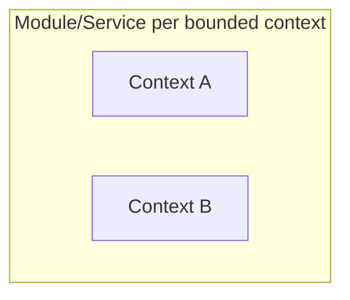

<!-- check-links: ignore -->
# Architecture — {{PROJECT_NAME}}

> Phase 3 deliverable of the architecture design. Approved on: {{DATE}}
> Inputs: [1-business-vision.md](1-business-vision.md) · [2-domain-model.md](2-domain-model.md)
> Structural decisions: see [../decisions/](../decisions/) (authoritative index: [../decisions/README.md](../decisions/README.md))

## 1. Overview

Style: {{modular monolith | services | hybrid}} — decided in {{ADR-00X}}

## 2. APIs

| Boundary | Consumer | Style | Main operations (ubiquitous language) |
|---|---|---|---|
| {{context}} | {{UI/context/external}} | {{synchronous REST / event}} | {{e.g.: POST /orders → ConfirmOrder}} |

## 3. Events and propagation

| Event | Crosses | Can be lost? | Can be duplicated? | Needs ordering? | Mechanism |
|---|---|---|---|---|---|
| {{event}} | {{A→B}} | {{y/n}} | {{y/n}} | {{y/n}} | {{outbox+polling / broker / NOTIFY}} |

Mechanism upgrade trigger: {{measurable condition that justifies switching — recorded in the ADR}}

## 4. External integrations

| System | Contract | Expected reliability | Protection (ACL/retry/circuit) |
|---|---|---|---|
| {{which}} | {{API/file/webhook}} | {{real SLA}} | {{strategy}} |

## 5. Data

One schema per context; no context reads another's table.

| Context | Schema | Main tables (derived from the aggregates) | Special needs |
|---|---|---|---|
| {{ctx}} | {{schema}} | {{tables}} | {{search/vector/none}} |

Estimated volumetry: {{honest number + growth}}

## 6. Cross-cutting

- **Auth:** {{who can do what; mechanism — see ADR}}
- **Observability:** {{what stays visible when something goes wrong}}
- **LGPD:** {{personal data: where it lives, who accesses it, how it is deleted}}

## ADRs of this phase

> Lists only the decisions born in Phase 3. The authoritative index is [../decisions/README.md](../decisions/README.md); if they diverge, the index wins and this file is corrected.

| ADR | Decision | Situation |
|---|---|---|
| [ADR-001](../decisions/ADR-001-{{slug}}.md) | {{title}} | accepted |
