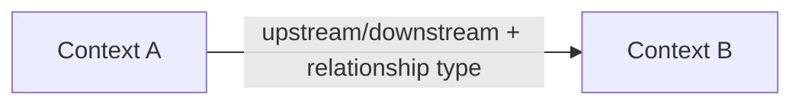

<!-- check-links: ignore -->
# Domain Model — {{PROJECT_NAME}}

> Phase 2 deliverable of the architecture design. Approved on: {{DATE}}
> Input: [1-business-vision.md](1-business-vision.md)

## 1. Context map

| Bounded context | Responsibility (one sentence) | Glossary terms it owns |
|---|---|---|
| {{context}} | {{responsibility}} | {{terms}} |

Translations needed (anticorruption layers): {{where one context needs to translate another's model}}

## 2. Aggregates

### {{Aggregate Name}} (context: {{which}})

- **Root:** {{root entity}}
- **Invariant it protects:** {{rule — traceable to R# of the business vision}}
- **Members:** {{internal entities and VOs}}
- **Consistency:** immediate within the boundary; with {{another aggregate}} via event {{which}}

## 3. Entities

| Entity | Context | Identity | Born when | Dies/ends when |
|---|---|---|---|---|
| {{name}} | {{ctx}} | {{what identifies it}} | {{event}} | {{event}} |

## 4. Value objects

| VO | Describes | Intrinsic validations |
|---|---|---|
| {{name}} | {{what}} | {{rules that prevent an invalid VO from existing}} |

## 5. Domain events

| Event (past-tense verb) | Emitted by | Cares about it | Crosses context? |
|---|---|---|---|
| {{OrderConfirmed}} | {{aggregate}} | {{who reacts}} | {{yes/no}} |

## New terms that emerged in modeling

{{terms added to the Phase 1 glossary during this phase — keep the glossary as the single source}}
